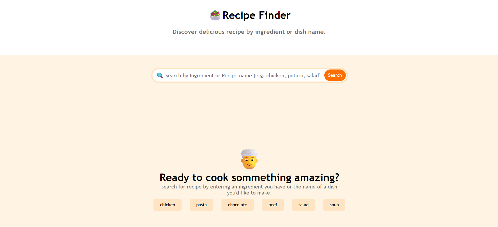
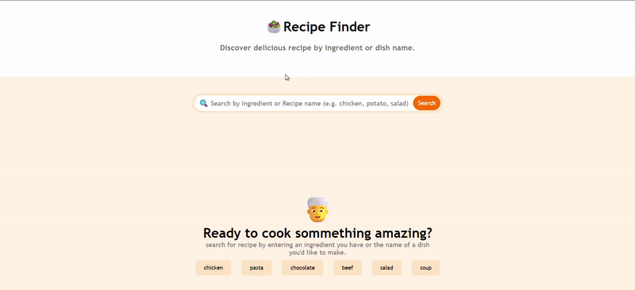

# 🍽️ Recipe Finder


---

## 📸 Screenshots

> ### 🔍 Search & Results View




## 🎞️ Demo



> 🔗 **[Live Demo](https://yourusername.github.io/recipe-finder/)** — Try it out now!

---

## 🧠 Project Overview

**Recipe Finder** is a modern web app that helps users search for delicious recipes using any ingredient or dish name. Built using HTML, CSS, and JavaScript, it integrates with **TheMealDB API** to fetch real-time meal suggestions, detailed cooking instructions, and categorization.

Its minimal UI and engaging design make cooking discovery enjoyable. Users can view meal cards with images, explore ingredients, and access the full recipe with a single click.

---

## 🚀 Features

- 🔍 Search by **ingredient** or **dish name**
- ⚡ Instant suggestions via clickable buttons (chicken, pasta, chocolate, etc.)
- 🧾 Full recipe details including category, area, tags, and video link
- 🧪 Interactive **loading spinner** while fetching data
- 💡 Intuitive **card layout** for search results
- 📱 Fully **responsive design** for all devices
- 🔁 Switch between result list and full recipe view

---

## 🛠️ Technologies Used

| Layer     | Tech Stack                      |
|-----------|----------------------------------|
| 🖥️ Frontend | HTML5, CSS3, JavaScript (ES6)    |
| 🌐 API     | [TheMealDB API](https://www.themealdb.com/api.php) |
| 🎨 UI      | Responsive Layout, Font Awesome Icons |
| 🧪 Optional | GitHub Pages for deployment     |

---


---

## 🔮 Future Enhancements

- ✅ Add "Add to Favorites" feature with localStorage
- ✅ Filter by meal type (vegetarian, non-veg, dessert, etc.)
- 🌎 Multi-language support
- 🗂 Tag-based or category-wise sorting
- 🧾 Add nutrition data using additional API

---

## 🧪 How to Use Locally

1. **Clone this repo**
   ```bash
   git clone https://github.com/yourusername/recipe-finder.git

